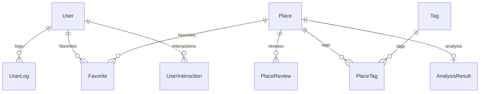

# Vibe-Checker: Full Codebase Analysis

A comprehensive analysis of the Vibe-Checker application - an AI-powered place discovery and analysis platform.

---

## 🏗️ Technology Stack Overview

### Backend
| Technology | Purpose |
|-----------|---------|
| **FastAPI** | Web framework with async support |
| **SQLAlchemy** | ORM with async PostgreSQL support |
| **Redis** | Caching layer for analysis results |
| **Celery** | Background task processing |
| **Google Gemini AI** | LLM for place analysis and recommendations |
| **Qdrant** | Vector database for semantic search |
| **FastEmbed** | Text embeddings (multilingual-e5-large) |
| **CrossEncoder** | Reranking model (BAAI/bge-reranker-v2-m3) |
| **Docker Compose** | Containerized deployment |

### Frontend
| Technology | Purpose |
|-----------|---------|
| **Next.js 14** | React framework with App Router |
| **TypeScript** | Type-safe JavaScript |
| **Tailwind CSS** | Utility-first styling |
| **Shadcn/ui** | UI component library |
| **2GIS MapGL** | Interactive map rendering |
| **Recharts** | Data visualization charts |
| **React Hook Form + Zod** | Form handling with validation |

---

## 🔧 Backend Architecture

### Entry Point: [main.py](file:///c:/Users/ikotti/Downloads/%D0%BF%D1%88/Vibe-Checker/app/main.py)

The FastAPI application initializes with:
- **CORS middleware** (allowing all origins)
- **Lifespan context manager** for async database table creation
- **Rotating file handler** for system logging

### API Routers

```
/users      → User authentication & management
/place      → Place analysis, comparison, and Pro Mode search
/rec        → Personalized recommendations ("Inspire Me")
/admin      → Admin panel (protected, requires ADMIN role)
/interactions → User-place interactions (likes, dislikes, visited)
```

---

## 📊 Database Models

### Core Entities



| Model | Key Fields |
|-------|-----------|
| **User** | email, first_name, last_name, role (ADMIN/USER/SERVICE), hashed_password |
| **Place** | google_place_id, name, address, coordinates, google_rating, photos, description |
| **PlaceReview** | author_name, rating, text, published_time |
| **AnalysisResult** | summary (JSON), scores (JSON), vibe_score, price_level, best_for, detailed_attributes |
| **UserInteraction** | place_id, rating (LIKE/DISLIKE/NONE), is_visited |
| **UserLog** | action_type (SEARCH/ANALYZE/COMPARE/INSPIRE_REQUEST), payload (JSON) |

---

## ⭐ Feature 1: Place Analysis

### Endpoint: `POST /place/analyze`
**File**: [place.py](file:///c:/Users/ikotti/Downloads/%D0%BF%D1%88/Vibe-Checker/app/endpoints/place.py)

### How It Works:

1. **Caching Check** - First checks Redis cache, then database for fresh analysis (<30 days old)
2. **Review Parsing** - If no cache, parses Google Maps URL to extract reviews
3. **AI Analysis** - Sends reviews + photos to **Gemini 2.5 Flash**
4. **Result Storage** - Saves analysis to database and Redis

### AI Analysis Output ([model.py](file:///c:/Users/ikotti/Downloads/%D0%BF%D1%88/Vibe-Checker/app/model_service/model.py)):

```json
{
  "summary": {
    "verdict": "Короткое описание на русском",
    "pros": ["Список плюсов"],
    "cons": ["Список минусов"]
  },
  "scores": {
    "food": 85,
    "service": 78,
    "atmosphere": 92,
    "value": 80
  },
  "vibe_score": 88,
  "tags": ["cozy", "wifi", "tasty_coffee"],
  "price_level": "$$",
  "best_for": ["work", "solo", "friends"],
  "detailed_attributes": {
    "has_wifi": true,
    "noise_level": "Low",
    "service_speed": "Fast",
    "cleanliness": "High"
  }
}
```

### Allowed Tags:
`quiet`, `noisy`, `cozy`, `luxury`, `party`, `instagrammable`, `wifi`, `power_outlets`, `pet_friendly`, `hookah`, `live_music`, `tasty_coffee`, `vegan_options`, `good_cocktails`, `craft_beer`, `fast_service`, `slow_service`, `friendly_staff`, `cheap`, `expensive`

### Allowed Scenarios:
`dating`, `friends`, `work`, `family`, `solo`, `breakfast`, `business`

---

## ⚔️ Feature 2: Place Comparison

### Endpoint: `POST /place/compare`
**File**: [service_comparator.py](file:///c:/Users/ikotti/Downloads/%D0%BF%D1%88/Vibe-Checker/app/services/service_comparator.py)

### Flow:
1. Analyze both places (using cached results if available)
2. Send both analyses to Gemini for head-to-head comparison
3. Return structured comparison with:
   - Winner per category (food, service, atmosphere, value)
   - Key differences
   - Unique pros for each place
   - Final verdict

### Frontend Display ([compare/page.tsx](file:///c:/Users/ikotti/Downloads/%D0%BF%D1%88/Vibe-Checker/app/frontend/app/%28dashboard%29/compare/page.tsx)):
- Side-by-side cards with unique pros
- Winner banner with trophy icon
- Head-to-head table for scores

---

## 🚀 Feature 3: Pro Mode (AI-Powered Vibe Search)

### Endpoint: `POST /place/pro_analyze`
**File**: [pro_mode/main.py](file:///c:/Users/ikotti/Downloads/%D0%BF%D1%88/Vibe-Checker/app/modules/pro_mode/main.py)

This is the **core innovative feature** of the application.

### Pipeline (6 Steps):

| Step | Action | Time |
|------|--------|------|
| 1 | Initialize Qdrant vector DB | ~0.1s |
| 2 | LLM converts user query → Google Maps search query | ~1s |
| 3 | Parse Google Maps results + reviews | ~5-15s |
| 4 | Save places to SQL database | ~0.5s |
| 5 | Upsert to Qdrant + semantic geo-filtered search | ~1s |
| 6 | CrossEncoder reranking + LLM explanation | ~2s |

### Key Services:

#### Vector Search ([vector_service.py](file:///c:/Users/ikotti/Downloads/%D0%BF%D1%88/Vibe-Checker/app/modules/pro_mode/vector_service.py)):
- Uses **Qdrant** for vector storage
- **multilingual-e5-large** embeddings (1024 dimensions)
- Geo-filtered search within specified radius
- Stores: name, address, reviews_summary, coordinates

#### Reranking ([llm_service.py](file:///c:/Users/ikotti/Downloads/%D0%BF%D1%88/Vibe-Checker/app/modules/pro_mode/llm_service.py)):
- **BAAI/bge-reranker-v2-m3** (CrossEncoder)
- Scores normalized to 0.5-0.99 range
- Top 5 results passed to explanation generation

#### Final Explanation:
- Gemini generates Russian-language reasons why each place matches the user's request
- Considers address, reviews summary, and original query

### Frontend Experience ([ProModeClient.tsx](file:///c:/Users/ikotti/Downloads/%D0%BF%D1%88/Vibe-Checker/app/frontend/app/%28dashboard%29/pro_mode/ProModeClient.tsx)):
- Animated particle backgrounds (Galaxy → Radar → Funnel → Neural Network)
- Loading HUD with dynamic stage text
- Results displayed on interactive 2GIS map

---

## 💡 Feature 4: Smart Recommendations ("Inspire Me")

### Endpoint: `POST /rec/inspire`
**File**: [recommendation/service.py](file:///c:/Users/ikotti/Downloads/%D0%BF%D1%88/Vibe-Checker/app/modules/recommendation/service.py)

### Personalization Flow:

1. **Gather User Context**:
   - Liked/disliked places from interactions
   - Places marked as visited
   - Recent search queries
   - Analyzed places (with tags)
   - Compared places

2. **Generate Discovery Query** (via Gemini):
   - Considers user preferences
   - Avoids disliked categories
   - Factors in current time of day
   - Returns natural language search query

3. **Execute Pro Mode** with generated query

### Example Context:
```
"User LOVES: Jazz Bar, Cozy Cafe. 
DISLIKES: Techno Club. 
Already visited: Coffee House.
Recent interests: romantic dinner; quiet workspace."
```

### Generated Query Output:
```
"Cozy jazz lounge with live music for romantic evening"
```

---

## 👤 Feature 5: User Authentication & Management

### Endpoints:
| Method | Path | Action |
|--------|------|--------|
| POST | `/users` | Register new user |
| POST | `/users/token` | Login (OAuth2 password flow) |
| GET | `/users/me` | Get current user |
| DELETE | `/users` | Delete account |

### Security:
- Password hashing with bcrypt
- JWT tokens stored in cookies
- Role-based access (USER, ADMIN, SERVICE)

---

## 👍 Feature 6: User Interactions

### Endpoint: `POST /interactions/update`
**File**: [interactions/service.py](file:///c:/Users/ikotti/Downloads/%D0%BF%D1%88/Vibe-Checker/app/modules/interactions/service.py)

### Actions:
- **Like/Dislike** places (affects future recommendations)
- **Mark as Visited** (excluded from recommendations)

### States:
```typescript
enum LikeState {
  LIKE = "LIKE",
  DISLIKE = "DISLIKE", 
  NONE = "NONE"
}
```

---

## 🛡️ Feature 7: Admin Panel

### Protected Routes (require ADMIN role):
| Path | Function |
|------|----------|
| `/admin/stats` | Dashboard with DB health, user count, active tasks |
| `/admin/logs` | View system logs (last N lines) |
| `/admin/logs/download` | Download full log file |
| `/admin/logs/clear` | Clear log cache |
| `/admin/users` | List all users |
| `/admin/users/{id}/role` | Change user role |

### Dashboard Stats:
- Database health check
- Total registered users
- Active parsing tasks
- Service dynamics chart (mock data)

---

## 🗺️ Frontend Pages

### Landing Page ([page.tsx](file:///c:/Users/ikotti/Downloads/%D0%BF%D1%88/Vibe-Checker/app/frontend/app/page.tsx))
- Full-screen snap-scroll sections
- Hero with gradient search bar
- Feature showcase (Vibe Signatures, AI Summary)
- CTA to launch map

### Map Page ([MapClient.tsx](file:///c:/Users/ikotti/Downloads/%D0%BF%D1%88/Vibe-Checker/app/frontend/app/%28dashboard%29/map/MapClient.tsx))
- 2GIS MapGL integration
- Results sidebar (desktop)
- Mobile bottom sheet
- User location marker
- Place markers with category icons

### Analysis Page ([analysis/page.tsx](file:///c:/Users/ikotti/Downloads/%D0%BF%D1%88/Vibe-Checker/app/frontend/app/%28dashboard%29/analysis/page.tsx))
- URL input form
- Bar chart for scores (Recharts)
- Tags display
- Detailed attributes grid

### Compare Page ([compare/page.tsx](file:///c:/Users/ikotti/Downloads/%D0%BF%D1%88/Vibe-Checker/app/frontend/app/%28dashboard%29/compare/page.tsx))
- Two URL inputs
- Winner banner
- Side-by-side unique pros
- Head-to-head category table

### Profile Page ([profile/page.tsx](file:///c:/Users/ikotti/Downloads/%D0%BF%D1%88/Vibe-Checker/app/frontend/app/%28dashboard%29/profile/page.tsx))
- Saved places collection
- Account settings
- Delete account with confirmation dialog

---

## 🌐 Internationalization

**File**: [lib/i18n](file:///c:/Users/ikotti/Downloads/%D0%BF%D1%88/Vibe-Checker/app/frontend/lib/i18n)

- Language context provider
- Multiple language support (EN/RU at minimum)
- All UI text wrapped in `t.` translation function

---

## 🎨 UI/UX Features

### Theme System:
- Light/dark mode toggle
- CSS variables for consistent theming
- Shadcn/ui components

### Mobile Optimizations:
- Floating navigation dock
- Bottom sheet for map results
- Touch-friendly interactions

### Animations:
- Particle backgrounds in Pro Mode (Galaxy, Radar, Funnel, Neural Network)
- Loading HUD with stage transitions
- Smooth page transitions

---

## 📁 Directory Structure

```
Vibe-Checker/
├── app/
│   ├── main.py                    # FastAPI entry point
│   ├── config.py                  # Settings (Gemini API key, etc.)
│   ├── database.py                # SQLAlchemy async engine
│   ├── dependencies.py            # DI helpers (get_db, get_current_user)
│   ├── security.py                # JWT & password utilities
│   │
│   ├── endpoints/                 # API routes
│   │   ├── users.py
│   │   ├── place.py
│   │   ├── recommendation.py
│   │   ├── admin.py
│   │   └── interaction.py
│   │
│   ├── modules/                   # Domain modules
│   │   ├── user/                  # User models, schemas, service
│   │   ├── place/                 # Place models, parsing
│   │   ├── analysis_result/       # AI analysis storage
│   │   ├── pro_mode/              # Vector search + LLM
│   │   ├── recommendation/        # Inspire Me logic
│   │   ├── interactions/          # Likes/dislikes
│   │   ├── favorites/             # Saved places
│   │   ├── tag/                   # Place tags
│   │   ├── place_tag/             # M2M relationship
│   │   ├── parsing/               # Google Maps parser
│   │   └── admin/                 # Admin utilities
│   │
│   ├── services/                  # Business logic
│   │   ├── service_analyzator.py  # Place analysis orchestration
│   │   └── service_comparator.py  # Comparison logic
│   │
│   ├── model_service/             # AI/ML models
│   │   └── model.py               # Gemini API calls
│   │
│   └── frontend/                  # Next.js app
│       ├── app/                   # App Router pages
│       ├── components/            # Reusable components
│       ├── lib/                   # Utilities, API client
│       ├── services/              # API service functions
│       └── types/                 # TypeScript types
│
├── docker-compose.yml             # Container orchestration
├── Dockerfile                     # Python image
└── requirements.txt               # Python dependencies
```

---

## 🔑 Key Design Decisions

1. **Caching Strategy**: Redis + DB caching with 30-day freshness threshold
2. **Vector Search**: Qdrant with geo-filtering for location-aware semantic search
3. **Two-Stage Ranking**: Vector similarity → CrossEncoder reranking for quality
4. **User Signals**: Likes/dislikes feed into recommendation personalization
5. **Async Everywhere**: Full async support for better concurrency
6. **Mock API Mode**: Frontend can run with mock data for development

---

## 📝 Summary

**Vibe-Checker** is a sophisticated place discovery platform that combines:
- Traditional place data (Google Maps integration)
- AI-powered analysis (Gemini for reviews → insights)
- Semantic search (Vector DB + embeddings)
- Personalization (User interaction history)
- Modern frontend (Next.js + interactive maps)

The application solves the problem of finding places that match a specific "vibe" rather than just keywords, using advanced NLP techniques and user preference learning.
